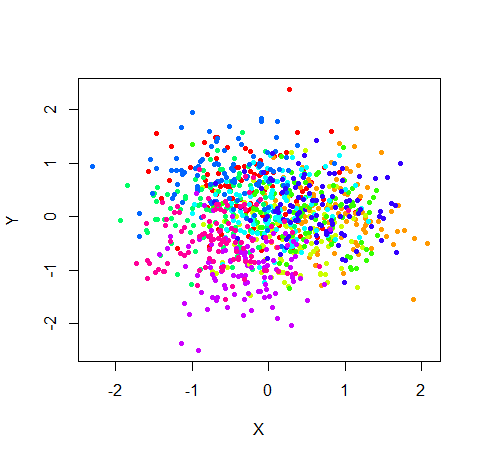
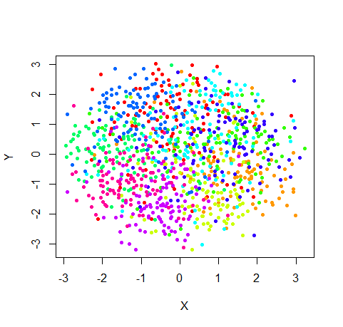
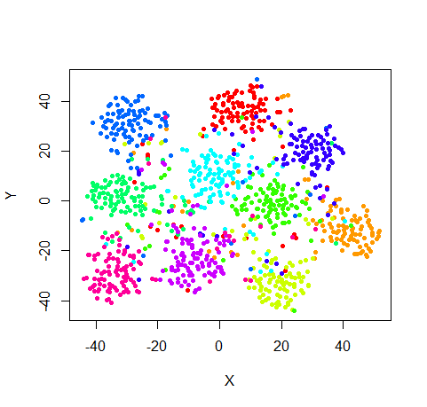

Previous: [Concepts](concepts.html). Next: [Preprocessing](preprocessing.html). Up: [Index](index.html).

## Data Format

`sneer` can take two types of input data, a data frame or a distance matrix.

### Data Frame
Each row should be an observation and each column a different 
variable. For examples of suitable data sets, see below. Sneer uses only numeric
vectors for its calculations and ignores anything else. However, if you have a 
factor column or a column of colors (e.g. RGB strings), that data can be used 
to color the plot. See the [Visualization](visualization.html) section for more
on that.

### Distance Matrix
Alternatively, a distance matrix of class `dist`. For visualization you will
want to come up with an appropriate vector from somewhere and pass it in via
the `colors` or `labels` parameter. Again, see the 
[Visualization](visualization.html) section for more.


If the data is in the correct format, you are ready to sneer it. The next 
section covers [Preprocessing](preprocessing.html). But below are some sources
of potential datasets.

## Sources of Data

Once you start experimenting with sneer, it's useful to have multiple sources
of data to try your ideas out on. The following are some data sets which 
researchers in the field have used or which I have known and loved.

### iris

For just fiddling about, the good old `iris` dataset has the advantage of 
being small. But with only 4 numeric measurements per iris, that's not a very 
high-dimensional data set. In low-dimensional situations, you're unlikely to
see the advantages of t-SNE. I suggest being very wary of drawing 
conclusions from data sets where something like PCA, metric MDS or Sammon 
mapping does a very good job. t-SNE just isn't necessary under these 
circumstances. Lucky for you, sneer can carry out PCA, MDS and Sammon mapping
while keeping all the other options the same, so you should be able to find out
quite quickly if this is the case.

### s1k

sneer comes with a data set called `s1k`. It's entirely synthetic and designed
to reproduce the "crowding problem" that t-SNE sets out to solve. The crowding
problem is due to there being a lot more volume around a point in high 
dimensional space than in a 2D plot. Imagine a point in the middle of a cube
with its nearest neighbors being on each of the six faces. There's no way we
can reproduce that in two dimensions, at best we can have four nearest 
neighbors, with the other two out in the comparative cold. The problem gets
worse in higher dimensions. 

s1k is a fuzzy 9D simplex: there are 10 points which are all equidistant from 
each other. Each of those ten points was then replicated another 99 times each, 
adding some symmetric gaussian noise to its  coordinates. So we now have 1000 
points, consisting of 10 clusters each. I made the spread of the gaussian 
sufficiently large so that the overlap between clusters gave traditional
distance-based methods like PCA and metric MDS a hard time.

Without wanting to get too far ahead of ourselves, let's have a look at how 
PCA, MDS and t-SNE get on with s1k:



Yuk. If you squint, you can sort of see something. There's very noticeable
crowding, with a lot of points crushed in the center of the plot. That's
characteristic of trying to stuff a high dimensional data set into 2D.



That's a bit better. But if I hadn't colored the clusters in the plot, you'd
be hard pressed to tell me what structure the data had.



Yay. Much better. t-SNE really does make a difference.

So there you go. s1k passes my low bar for being a useful data set. We could 
(and probably should) make life a bit harder for ourselves. Real data will
differ from s1k by having different numbers of points per cluster, different
distances between clusters, different spreads of data in the cluster, and being
anisotropic (the spread won't be symmetric in all dimensions).

There are some other data sets out there you may find useful. In a fit of
shameless self-promotion, I will mention some other R packages I wrote that
help wrangle them into a sneer-able form.

None of the following packages are on CRAN, but are on github. To install them,
install the `devtools` package:

```R
install.packages("devtools")
```

Then use the `devtools::install_github` function to fetch them from github.

### snedata

Find the snedata package at https://github.com/jlmelville/snedata and install
it with:

```R
devtools::install_github("jlmelville/snedata")
```

Under the snedata umbrella, there are three sources of data here you might be 
interested in:

#### JSE simulation data.

Lee and co-workers have published some papers on a technique similar to t-SNE
called Jensen-Shannon Embedding - see the
[JSE](http://dx.doi.org/10.1016/j.neucom.2012.12.036) and 
[multi-JSE](http://dx.doi.org/10.1016/j.neucom.2014.12.095) papers.

In these papers, they use some simple simulation data sampled from shapes, 
including a 3D ball, the surface of a sphere, and helical toroid (this looks 
like a spring that's been stretched round in a circle so the ends meet). The
snedata has data sets which are very similar to these.

#### "How to Use t-SNE Effectively"

A team at Google (Cloud and Brain) published an interactive article
[How to use t-SNE Effectively](http://distill.pub/2016/misread-tsne/), 
containing some tips on the effect of parameters on t-SNE embeddings. You can
run t-SNE directly in the browser on that page on a set of simulation data,
much of it based around various gaussian clusters. I converted JavaScript code
which generated these datasets, also available on github at 
https://github.com/distillpub/post--misread-tsne, into R, so these are
also available for you to use.

#### Olivetti and Frey Faces

These are two sets of face data (images of different people's faces taken at
different angles) that have been used in the literature. They are available in
the R package [RnavGraphImageData](https://cran.r-project.org/package=RnavGraphImageData)
but not in a format that can be directly used by sneer. The snedata package
also provides functions to transform those datasets so sneer can use them. If 
you want to do this, you'll need to install RnavGraphImageData manually via 
`install.packages("RnavGraphImageData")`

### mnist

Find the mnist package at https://github.com/jlmelville/mnist and install it 
with:

```R
devtools::install_github("jlmelville/mnist")
```

The MNIST dataset is a set of images of hand written digits. It (or a subset)
is probably the most commonly used dataset used in the literature.

This package doesn't distribute the MNIST dataset directly, but downloads it
from its website and then formats it, so you'll need internet access to
get hold of it. Like the Frey and Olivetti data sets, there are also functions
to view each digit.

### coil20

Find the coil20 package at https://github.com/jlmelville/coil20 and install it
with:

```R
devtools::install_github("jlmelville/coil20")
```

Another image dataset (you may be detecting a pattern here), this time of 3D 
objects. Once again, this dataset doesn't distribute the images, just downloads
them and formats them for you. And it provides a function for viewing the 
images.

Between all these data sets, that should be enough data to be getting on with.
Watch out for the large data sets - due to sneer's design and pure-R nature,
it's easy to have it sit there churning away for hours, or just run out of 
memory. I suggest experimenting with sub sets of 100-1000 data points before 
committing to embedding the entire MNIST data set (hint: you probably don't 
want to do that).

Previous: [Concepts](concepts.html). Next: [Preprocessing](preprocessing.html). Up: [Index](index.html).
