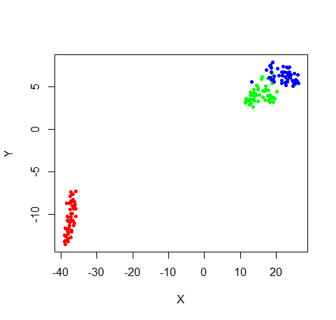

Welcome to the documentation for Sneer: Stochastic Neighbor Embedding 
Experiments in R. It's a pure R package for carrying out not only the 
popular [t-distributed SNE](https://lvdmaaten.github.io/tsne/), but also other 
related dimensionality reduction methods.

## Installing

Make sure you have the `devtools` package installed, then use that to
install `sneer`:

```R
install.packages("devtools")
devtools::install_github("jlmelville/sneer")
```

## Sneer Options

The different options available in sneer are covered by the sections below.

* [Embedding Concepts](concepts.html) - in which I try and define some generic
terms and the basic workflow used by all the methods covered in `sneer`.
* [Data Sets](datasets.html) - format of the input data and places to look for
data sets. 
* [Data Preprocessing](preprocessing.html) - basic filtering and scaling 
that sneer will apply to your input.
* [Input Initialization](input-initialization.html) - transforming the input
distances to probabilities or other parameterization needed for the optimization.
* [Output Initialization](output-initialization.html) - how to create the initial
output configuration.
* [Optimization](optimization.html) - controlling the type of optimization of
the output coordinates.
* [Embedding Methods](embedding-methods.html) - there's a whole family of 
embedding methods related to t-SNE out there. Let me introduce you.
* [Reporting](reporting.html) - understanding the logging info during 
optimization.
* [Exported Data](exported-data.html) - what data you can expect to be returned
from calling `sneer` (and the extra data you can ask for).
* [Analysis](analysis.html) - coming soon.
* [Visualization](visualization.html) - coming soon.
* [References](reference.html) - links to the research that introduced the various
methods in sneer. Coming soon.

The [examples](examples.html) page brings most of this together. The same 
examples can be found in the R documentation for the `sneer` function, i.e.
type `?sneer` at the R console.

## I just want to do t-SNE and not deal with all those options

Ok, let's use the iris data set as an example.

```R
library("sneer")
res <- sneer(iris)
```

You should see a running commentary on what sneer is doing being logged to the
console, including the iteration number, some error values (that get smaller)
and convergence information. After 1000 iterations, it stops.

Also, we saw a plot of the iris data, in three colored clusters slowly changing
shape as the embedding converged. Hopefully, it looks a bit like:



If you know anything about the iris data set the result shouldn't be very
surprising.

Anyway, the embedded coordinates are in the matrix `res$coords`. You 
probably have a much better idea about how to display and analyze the results
than I do. Off you go. Have fun.

## Theory

If you are at all curious about how the gradients are derived, perhaps because
you would like to tweak a cost function or similarity function, take a look
at the [gradients](gradients.html) page.

## Source

Available at https://github.com/jlmelville/sneer

